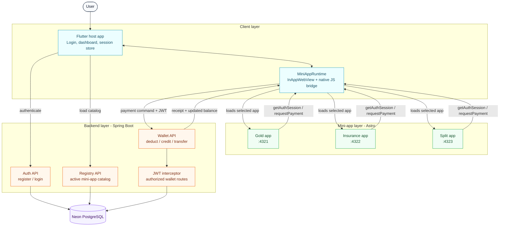

# Nexus Finance: Fintech Super App Proof of Concept (PoC)

Welcome to the **Nexus Finance** monorepo. This project demonstrates a secure, high-performance hybrid Super App architecture combining a native container, dynamic webview runtime environments, and decoupled micro-frontend mini-apps with E2E dynamic ledger synchronization.

---

## 1. Architecture Design

The ecosystem consists of three main building blocks:
* **Core Wallet Ledger & Registry (Java Spring Boot 3.x)**: Connected to **Neon PostgreSQL**, hashes credentials via **BCrypt**, serves active mini-apps, and secures transactions using a lightweight **JWT Interceptor** route guard.
* **Native Super App Shell (Flutter)**: Handles the authentication lifecycle (with custom Login and Registration screens) and stores session data securely. Exposes a `getAuthSession` bridge handler to MFEs and injects active JWTs into proxy headers during payments.
* **Micro-Frontends (Astro)**: Decoupled, sandboxed micro-frontends that perform a secure handshake on mount to customized UI greetings or enter a lock-out "Unauthorized Session" state if credentials are invalid or expired.



Runtime flow:
1. The Flutter host authenticates the user and keeps the active JWT in `SecureSessionManager`.
2. The dashboard reads the backend registry and opens the selected Astro mini-app in `MiniAppRuntime`.
3. Mini-apps use the native JS bridge for session lookup and payment requests.
4. Wallet operations pass through the Spring Boot JWT interceptor before Neon PostgreSQL is updated.

---

## 2. Repository Structure

```text
nexus-finance-monorepo/
├── backend/                             # Core wallet engine & registry server (Spring Boot)
│   ├── pom.xml                          # Maven build file (Spring Web, Data JPA, Postgres, JWT, BCrypt)
│   └── src/
│       └── main/java/com/nexus/finance/
│           ├── controller/
│           │   ├── AuthController.java             # Handles CORS-secure Login & Registration endpoints
│           │   ├── MiniAppRegistryController.java  # Serves active mini-apps dynamically
│           │   └── WalletController.java           # DB-backed ledger operations (deduct, credit, transfer)
│           ├── model/
│           │   ├── MiniApp.java                    # Registry configuration structure
│           │   └── User.java                       # Postgres persistence model with plain boilerplate getters/setters
│           ├── repository/
│           │   └── UserRepository.java             # JPA data access layer for PostgreSQL
│           └── security/
│               ├── DataSeeder.java                 # Startup database seeder (seeds default user credentials)
│               ├── JwtInterceptor.java             # Lightweight route guard verifying Bearer headers
│               ├── JwtUtil.java                    # HMAC256 token signer and parser
│               └── WebMvcConfig.java               # Configures path intercepts on /wallet/*/deduct
├── host-app/                            # Native shell container (Flutter)
│   ├── pubspec.yaml                     # Dependencies (flutter_inappwebview, http)
│   └── lib/
│       ├── main.dart                    # Starts application routing at LoginScreen
│       └── screens/
│           ├── dashboard_screen.dart    # Active user greeting, ledger controls, and dynamic catalog list
│           ├── login_screen.dart        # Sleek dark-mode form capturing credentials and hitting backend
│           ├── register_screen.dart     # BCrypt-secured signup screen that auto-funds accounts with $1500
│           ├── secure_session_manager.dart # In-memory active session token wrapper
│           └── mini_app_runtime.dart    # Webview shell exposing requestPayment and getAuthSession handlers
└── mini-apps/                           # Decoupled micro-frontend applications
    ├── gold-app/                        # Astro Digital Gold app with sparkline canvas chart & gold calculator (Port 4321)
    ├── insure-app/                      # Astro Micro-Insurance app with carrier checker & plan rows (Port 4322)
    └── split-app/                       # Astro Bill Splitter app with stepper splits & tax/tip sliders (Port 4323)
```

---

## 3. How to Run the Ecosystem

Ensure you have Java JDK 17+, Node.js (v18+), Maven, and Flutter SDK installed.

### Step 1: Start the Spring Boot Backend (Port 8080)
Open a terminal, navigate to the backend folder, and run:
```bash
cd backend
mvn spring-boot:run
```
*Note: On startup, database schema migrations will automatically sync with Neon PostgreSQL, and default test accounts will seed:*
* *Username: `sarthak` (Password: `password123`)*
* *Username: `user-001` (Password: `password123`)*

### Step 2: Start the Astro Micro-Frontends
Open three separate terminal sessions to launch the micro-frontend dev servers:
* **Nexus Digital Gold** (Port 4321):
  ```bash
  cd mini-apps/gold-app
  npm install
  npm run dev
  ```
* **InsureMe Flight Protection** (Port 4322):
  ```bash
  cd mini-apps/insure-app
  npm install
  npm run dev
  ```
* **Split-It Bill Splitter** (Port 4323):
  ```bash
  cd mini-apps/split-app
  npm install
  npm run dev
  ```

### Step 3: Run the Flutter Host App
Launch the Flutter native shell targeting your emulator or device:
* **Android Emulator**:
  ```powershell
  cd host-app
  flutter run `
    --dart-define=REGISTRY_HOST=http://10.0.2.2:8080 `
    --dart-define=BACKEND_HOST=http://10.0.2.2:8080
  ```
* **iOS Simulator / Desktop / Web**:
  ```bash
  cd host-app
  flutter run --dart-define=REGISTRY_HOST=http://localhost:8080 --dart-define=BACKEND_HOST=http://localhost:8080
  ```

---

## 4. Key Verification Features

* **Secure Unified Authentication Flow**: Users must sign in or register through native forms. Credentials check against BCrypt hashes stored in a Neon PostgreSQL cluster. On verification, a JWT token is saved native-side.
* **WebView Handshake**: Sandboxed webview micro-frontends perform a dynamic bridge handshake (`getAuthSession`) upon loading to lock-out unauthorized clients or customized layouts with user profiles.
* **Database Ledger Updates**: All balance inquires, ledger deductions, and peer transfers run as transactional JPA queries against Postgres, immediately reflecting on the host dashboard when MFEs exit.
